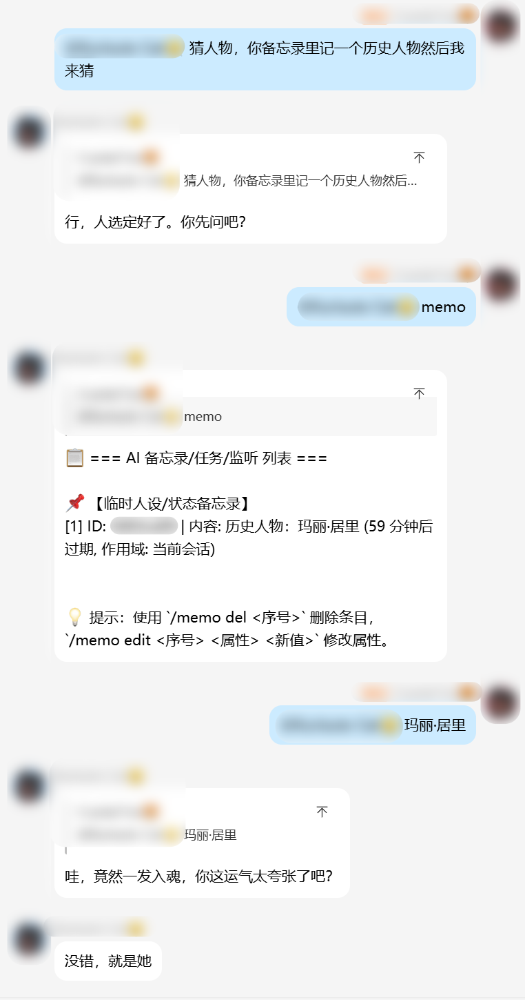
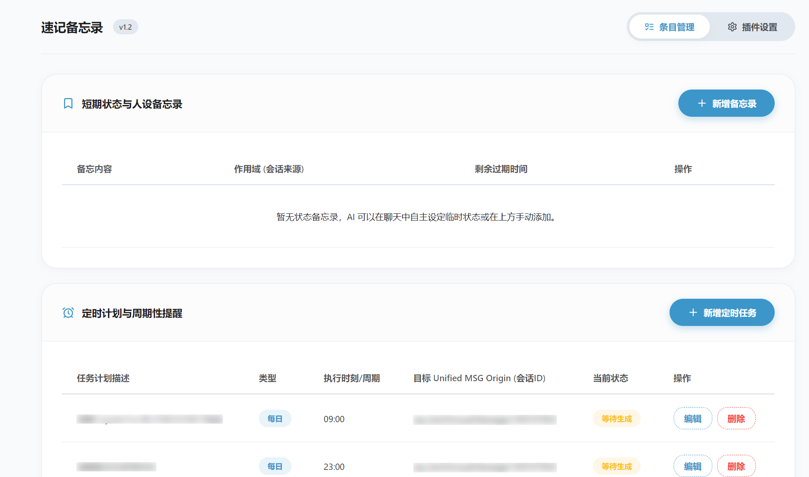
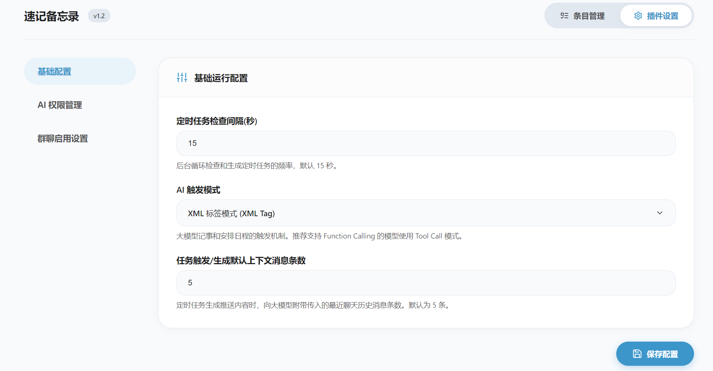

  
  <h1>速记备忘录 (astrbot_plugin_instant_memo)</h1>

一款为 AstrBot 设计的 **AI 自治备忘录**插件。与传统的"用户手动设闹钟"不同，本插件让 AI 自身拥有"记事本"和"日程表"——它可以自主记录状态备忘、创建定时/周期任务、注册关键词搭话监听，且一切操作均在对话中自然完成，无需用户学习额外指令。

同时，本插件提供了一个现代化的前端管理面板，支持实时对条目进行可视化增删改查。

---

##  与传统备忘录/定时任务插件有何不同？

| 对比维度 | 传统备忘录/定时插件 | 速记备忘录 (Instant Memo) |
| :--- | :--- | :--- |
| **触发方式** | 用户手动输入指令设置 | AI 在对话中自主判断并创建 |
| **WebUI 可视化管理** | 仅支持查看 | 提供完备的增删改查可视化管理面板 |
| **AI 权限微调** | 无法限制 | 细粒度控制 AI 的增/改/删权限以及启用的备忘形式 |
| **定时任务内容** | 固定文本或简单模板 | 触发前动态读取上下文，由 LLM 实时渲染生成 |
| **周期任务支持** | 通常仅支持单次提醒 | 支持单次 / 每日 / 间隔循环三种模式 |
| **关键词搭话** | 不支持 | AI 可注册关键词监听，命中时结合上下文主动搭话 |
| **状态备忘录** | 不支持 | AI 可为自己设置临时人设/状态，到期自动过期 |

---

##  WebUI 可视化管理面板

插件内置了现代、美观、契合 AstrBot 原生夜间模式的毛玻璃管理界面，提供两大主功能区：

### 1. 条目管理 (Item Management)

* **短期状态与人设备忘录**：实时查看 AI 当前的临时记忆状态及剩余时间。支持管理员手动新增、编辑或删除状态备忘。
* **定时计划与周期性提醒**：列出所有运行中的定时和周期提醒任务（单次、每日、定期间隔），以及任务的最新生成状态。
* **关键词搭话与主动监听**：管理已注册的关键词主动搭话监听器，可直接修改触发词、搭话策略及引用的上下文深度。

*所有新增与修改均在毛玻璃遮罩的动态模态框中完成，体验流畅。*

### 2. 插件设置 (Rich Settings)

* **基础运行配置**：设置定时任务后台轮询频率，切换触发模式（Tool Call / XML Tag），以及设置生成定时提醒时大模型获取的默认聊天上下文消息条数。
* **大模型操作权限控制**：
  * `ai_allow_add`：是否允许 AI 主动创建条目。
  * `ai_allow_update`：是否允许 AI 在对话中修改条目参数。
  * `ai_allow_delete`：是否允许 AI 主动删除条目。
* **AI 备忘形式限制**：
  * 可单独开关状态备忘录、定时任务、关键词监听，防止大模型胡乱设置任务。
* **群聊启用设置**：
  * 支持**全局备忘录**开关。
  * 支持**群聊启用过滤模式**（全部群聊启用 / 仅白名单启用 / 黑名单禁用），可在文本框中配置目标群聊号码列表，确保机器人在指定群组安全运行。

---

##  配置说明

插件启用后，可在 AstrBot 控制面板或插件管理 WebUI 中配置以下选项：

| 配置项 | 类型 | 默认值 | 说明 |
| :--- | :--- | :--- | :--- |
| `poll_interval` | `int` | `15` | 后台循环检查定时任务的频率（秒）。 |
| `trigger_mode` | `string` | `tool` | 触发模式：`tool`（工具调用模式）或 `xml`（XML 标签模式）。 |
| `context_history_limit` | `int` | `5` | 定时任务/关键词搭话触发时，大模型能够阅读的最近上下文历史消息数。 |
| `ai_allow_add` | `bool` | `true` | 是否允许 AI 新建备忘条目。 |
| `ai_allow_update` | `bool` | `true` | 是否允许 AI 修改备忘条目。 |
| `ai_allow_delete` | `bool` | `true` | 是否允许 AI 删除备忘条目。 |
| `enable_status_memo_ai` | `bool` | `true` | 是否允许 AI 使用和写入“状态备忘录”。 |
| `enable_task_ai` | `bool` | `true` | 是否允许 AI 使用和设立“定时任务”。 |
| `enable_keyword_trigger_ai` | `bool` | `true` | 是否允许 AI 使用和设立“关键词搭话”。 |
| `allow_global_memo` | `bool` | `true` | 是否允许创建全局生效的备忘录。 |
| `group_filter_mode` | `string` | `all` | 群聊启用模式：`all` (全部群聊启用) / `whitelist` (仅白名单启用) / `blacklist` (黑名单禁用)。 |
| `group_list` | `string` | `""` | 目标群号列表，用逗号、空格或换行分隔。 |

---

##  功能详解

### 1. 状态/人设备忘录
AI 可以为自己设置临时的状态或人设备忘录，在有效期内会被注入到 System Prompt 中，过期后自动清除。
- 支持设定有效时长（分钟）
- 支持全局或当前会话作用域
- AI 可自主删除不再需要的备忘录

### 2. 定时/周期任务
AI 可以自主创建主动推送任务，在触发时刻到来前自动读取最新会话上下文，由 LLM 动态生成推送内容。
- **单次定时 (one_off)**：指定分钟数后触发一次
- **每日定时 (daily)**：每天固定时刻触发（HH:MM 格式）
- **间隔循环 (interval)**：每隔固定分钟数周期性触发

### 3. 关键词搭话监听
AI 可以注册关键词监听器，当群聊或私聊中出现指定关键词时，自动结合上下文生成搭话内容并主动发送。
- 支持全局或当前会话作用域
- 可配置上下文历史条数
- AI 可自主管理（创建/删除）触发器

---

##  用户管理指令

除了 Web 管理页面外，管理员在聊天中仍可通过以下指令手动管理所有备忘录、定时任务和关键词搭话：

| 指令 | 说明 |
| :--- | :--- |
| `/memo` 或 `/memo list` | 列出所有备忘录、定时任务与搭话监听器 |
| `/memo del <序号>` | 删除指定的条目 |
| `/memo edit <序号> <属性> <新值>` | 修改指定条目的属性 |

**可修改属性：**
- **状态备忘录**：`content`（内容）、`expire`（过期时间/分钟）、`global`（是否全局）
- **定时任务**：`desc`（描述）、`value`（触发时间）、`type`（类型: one_off/daily/interval）
- **关键词搭话**：`keyword`（触发词）、`desc`（回复设定）、`global`（是否全局）
